# Lab 1 – Setting up your Microsoft Entra tenant

## Objective

In this lab we will first redeem a pass for an Azure subscription.

When Entra ID tenants are created, they receive a onmicrosoft.com tenant
domain. In the real suppose you have just purchased a new domain that
resides in Microsoft Azure but not in Adatum's on-premises environment.
In this lab we will manually create the necessary DNS records required
by this new custom domain and then integrate a single AD forest using
Password Hash Sync (PHS). We will also enable MFS and add basic
conditional access policy.

## Exercise 1 – Integrate a single AD forest using Password Hash Sync (PHS)

### Task 1 – Install Azure AD Connect

**Password Hash Sync (PHS)**

Password hash synchronization is one of the sign-in methods used to
accomplish hybrid identity. Azure AD Connect synchronizes a hash, of the
hash, of a user's password from an on-premises Active Directory instance
to a cloud-based Microsoft Entra instance.

Password hash synchronization is an extension to the directory
synchronization feature implemented by Azure AD Connect sync. You can
use this feature to sign in to Azure AD services like Microsoft 365. You
sign in to the service by using the same password you use to sign in to
your on-premises Active Directory instance.

Password hash synchronization helps by reducing the number of passwords,
your users need to maintain to just one. Password hash synchronization
can:

*   Improve the productivity of your users.

*   Reduce your helpdesk costs.
#

1. Switch to the **LON-DC1** machine in the lab environment.

1.  Open a browser and navigate to the URL — `https://entra.microsoft.com/#view/Microsoft_AAD_Connect_Provisioning/AADConnectMenuBlade/~/GetStarted` sign in using Office 365 Tenant admin credentials from the Home/Resource tab.

2.  Click on **Download Connect Sync Agent** and then click after **4 seconds** click on **Accept terms & download** button.

    

2. Click on **Open file**.
    
    
1.  Once installed, the **Microsoft Entra Connect Sync** configuration
    will start. select the **Terms & Conditions** check box and click
    **Continue**.

    

2.  On the **Express Settings** page click **Customize**.

    

1.  On the Install required components page click **Install**.

    

1.  At the **User sign-in** page, choose **Password Hash
    Synchronization** as the **Sign On method** and click **Next**. We
    will use the MEConnect user we had created in the **Azure portal**
    to continue the installation process of **ADConnect**.

    

1.  On the Connect to Microsoft Entra ID page, provide the **Office 365 Tenant Admin** username and then click on the **Next** button.

    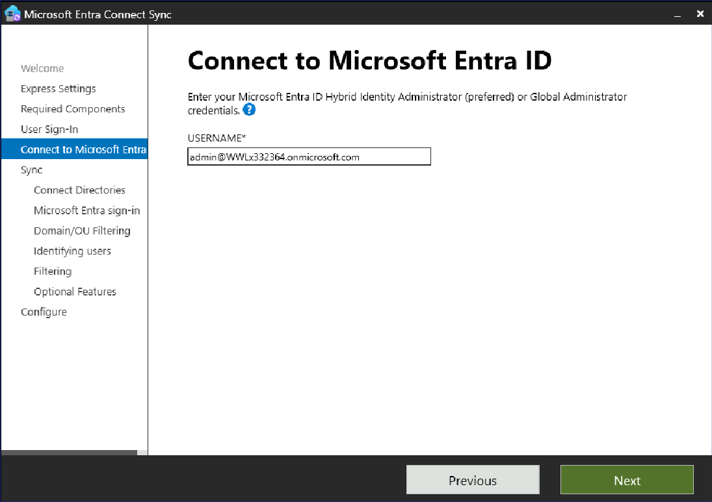

4.  Provide the credential of the credentials of the **Office 365 Tenant Admin** and then click on the **Next** button.

    

5.  On the connect your directories page click **Add directory**.

    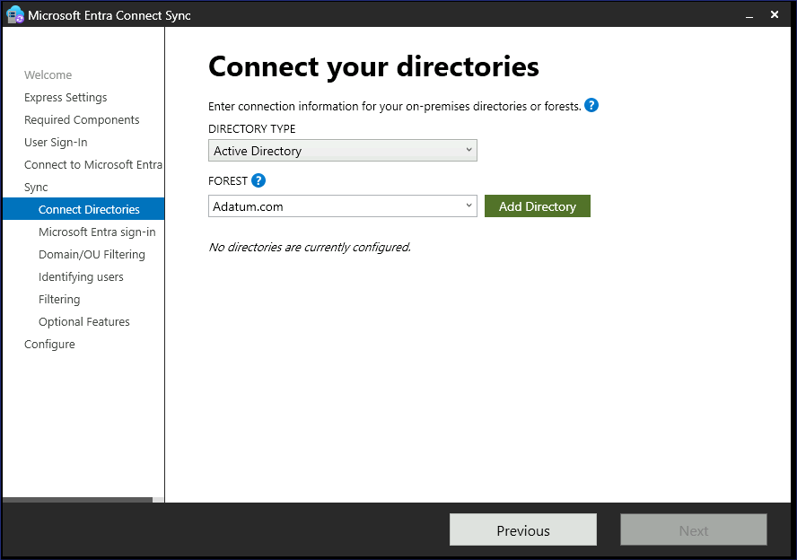

6.   On the **AD Forest account** window click **Create new account**
    and enter the AD Domain credentials **Username** - `ADATUM\Administrator` **Password** - `Pa55w.rd` click on the **OK** button.

    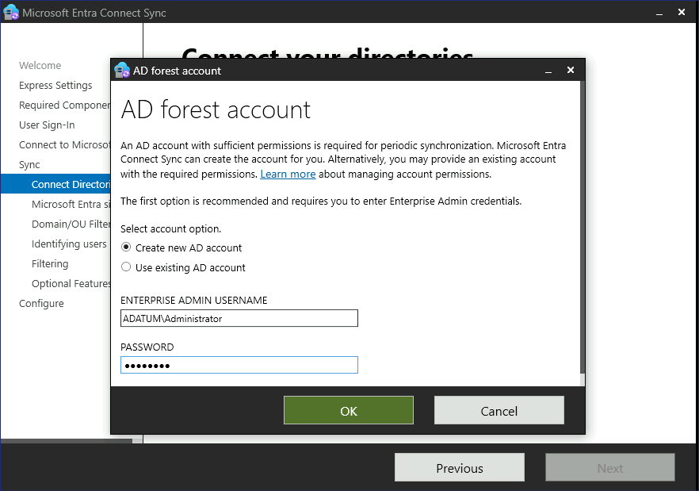

7.  Back on the **Connect your directories** page click on **Next.**

    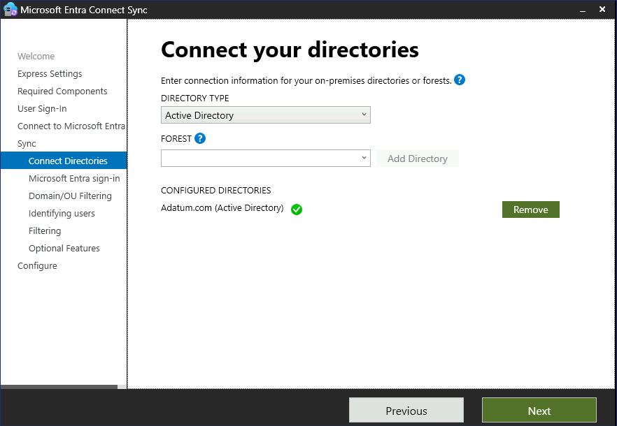

8.  On the **Microsoft Entra sign in configuration** page select the check box for
    **Continue without matching all UPN suffixes to verified domains**
    check box and click **Next**.

    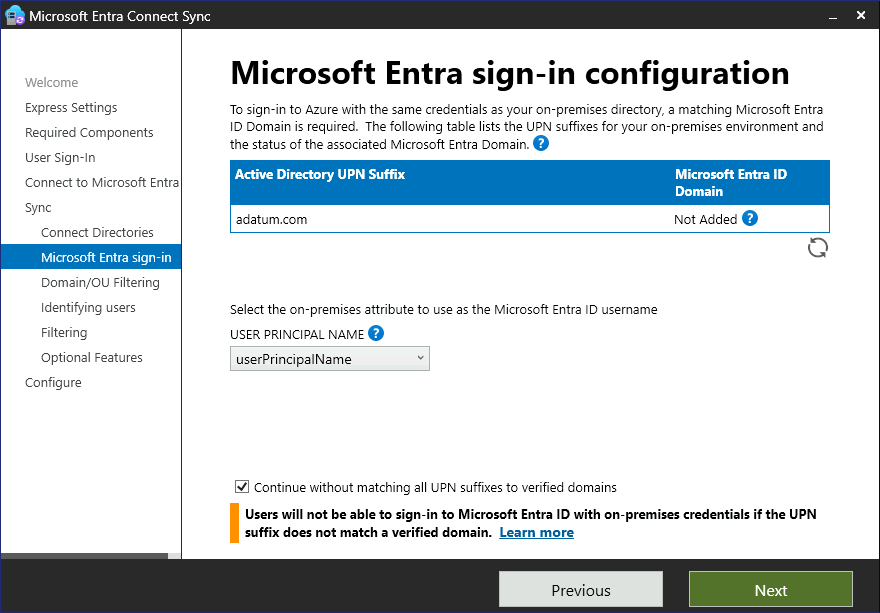

9.  On the **Domain and OU filtering** page select the Sync **selected
    domains and OUs** radio button and only select the **IT** OU and
    then click on **Next**

    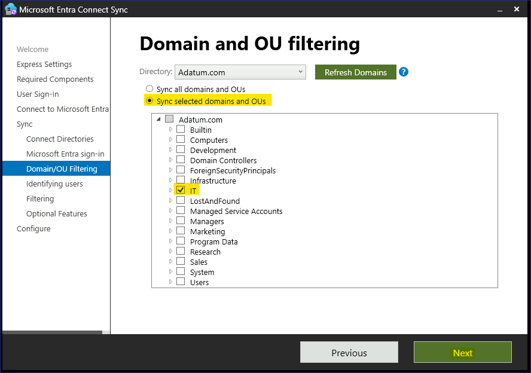

10. On the **Uniquely identify your users**, leave the default values
    and click on **Next**.

11. On the **Filter users and devices**, leave the default values and
    click on **Next**.

12. On the **Optional features**, leave the default values and click on
    **Next**.

13. On the **Ready to configure** page, click on the **Install** button.

    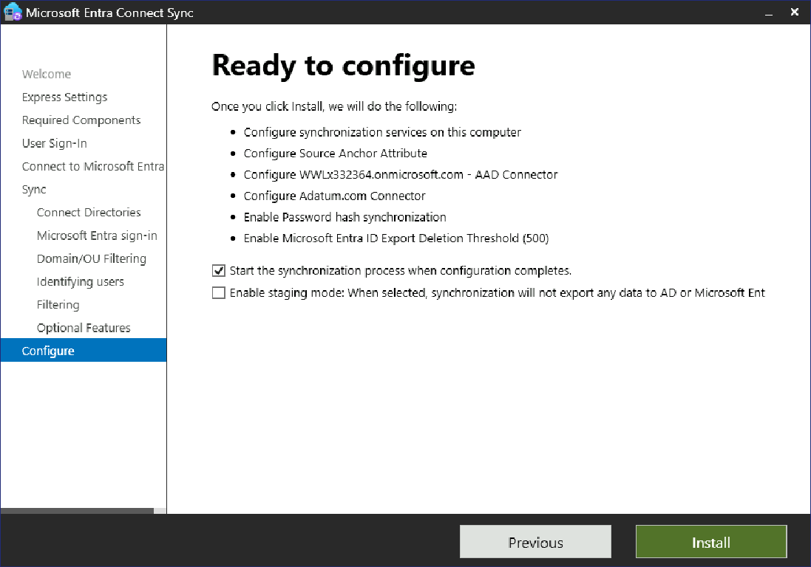

14. Once the installation is complete, select **Exit**.

    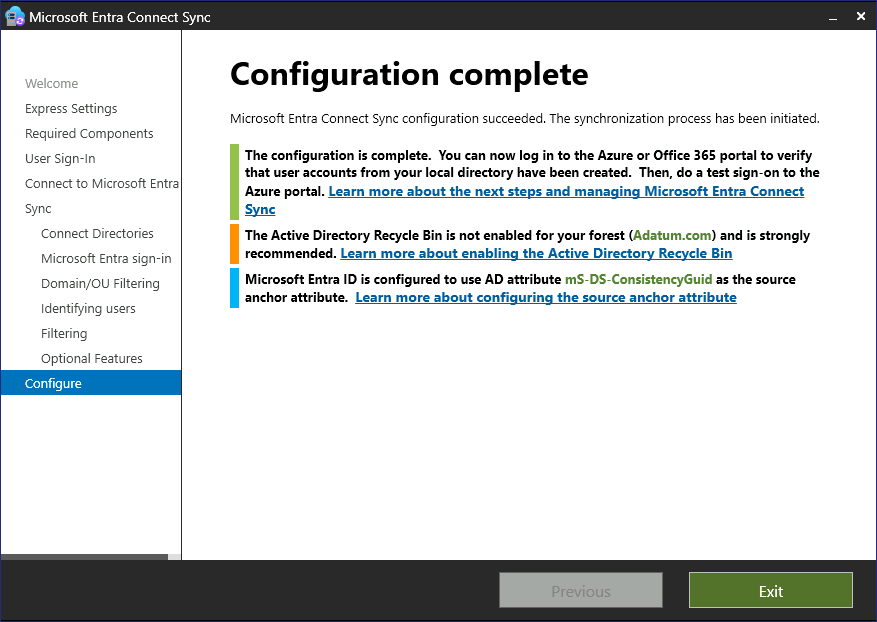

### Task 2 – Verify users are created and synchronization is occurring with Microsoft Entra ID

We will now verify that the users that we had in our on-premises
directory have been synchronized and now exist in Microsoft Entra ID
tenant. To verify users are synchronized do the following.

1. Switch back to the browser with the **Microsoft Entra admin center**
    opened, then select **Entra ID**, expand **Users**, select **All
    users**.

    

2. If required click on the Refresh button and verify that you see the
    new users in our tenant, the **On-premises synced** enabled.

    

    

3. From the list of users, select the user **Abbi Skinner**, then click
    on **Edit properties**

    

4. Select the **Settings** tab, then from the drop-down choose **United
    states** for Usage location and then click on the **Save** button.

    

    

5. Repeat the same steps to verify the Usage location for the below
    users.

    - Beth Burke

    - Huong Tang

    - Logan Boyle

**Note** - Usage location is necessary while assigning a License, the
License assignment will fail for a user who does not have a Usage
location.

## Exercise 3 – Create Groups and assign Licenses from Microsoft Entra admin center

### Task 1 - Create Groups and assign Licenses

1. Open the Edge browser and login to the **Microsoft Entra admin
    center** `https://entra.microsoft.com` page.

2. If prompted for credentials enter your **Office365 Tenant Credentials** provided on the **Home/Resources** tab of the lab Interface as
    show in the Image.

3. Select **Entra ID** expand the **Groups**, select **All groups**
    then click on **New group**.

    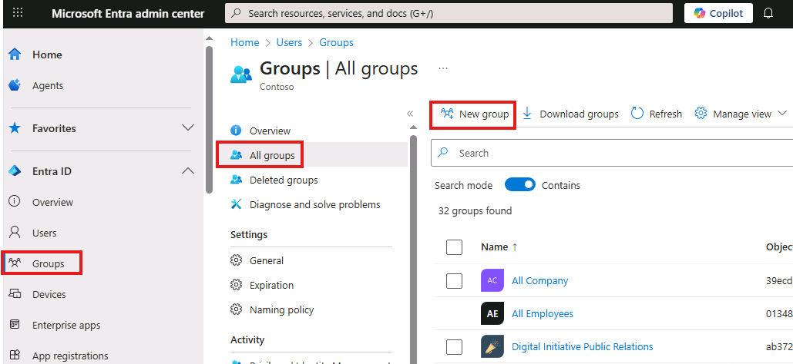

49. The **New Group** pane will appear, provide the below details.

    * Group type – **Security**

    * Group name – `Sales101`

    * Group Description – `Group for users in Sales department`

    - Microsoft Entra roles can be assigned to the group – **Yes**

    - Scroll down and click on link – **No members selected**

     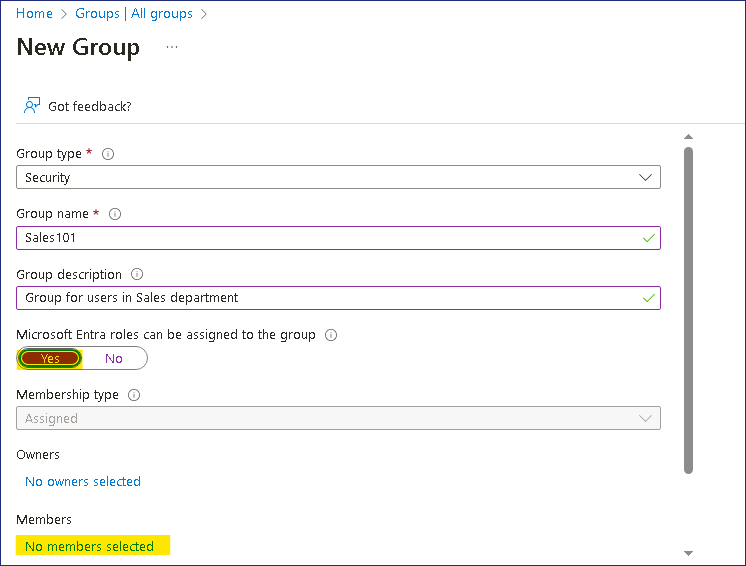

    - On the Add members tab, add **Abbi Skinner** and **Huong Tang** and
  click on **Select**.

     

    - Click on **Create**.

    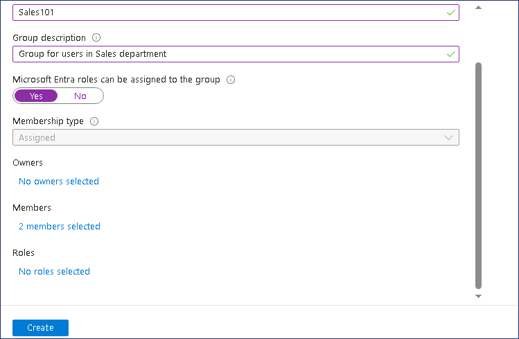

1.  You will get a prompt as shown in below image, click **Yes**.

    

1.  Your group is created, and you will get a successful notification.

    

1.  Repeat the steps 3-5 to create another group with below details

    * Group type – **Security**
    * Group name – `Research101`
    * Group Description – `Group for users in Research department`
    * Microsoft Entra roles can be assigned to the group – **Yes**

    - Members – **Beth Burke** and **Logan Boyle**

    

    

1.  You will get a prompt as shown in below image, click **Yes**.

    

3.  Once both the **Groups** have been created, click on the **Refresh**
    button and the Group list should appear as shown in the below image.

    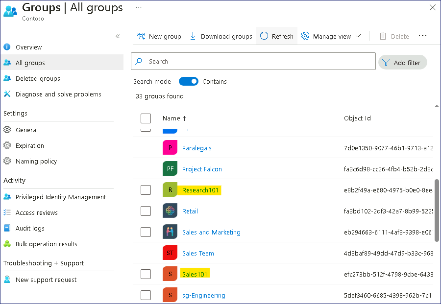

4.  While in the **Microsoft Entra admin center**, expand **Billing** then click on **Licenses**, then select **All
    Products**.

    

6.  Click on the **Microsoft 365 E5 (no Teams)** license, you will notice that
    **20/20** licenses have been assigned, we will release few licenses
    to be used for the upcoming steps.

    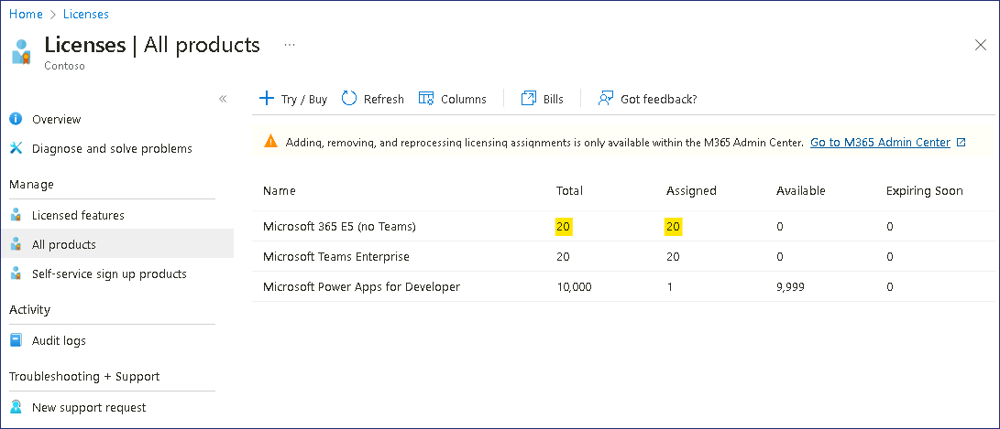

7.  Click on the **Go to M365 Admin Center** link
    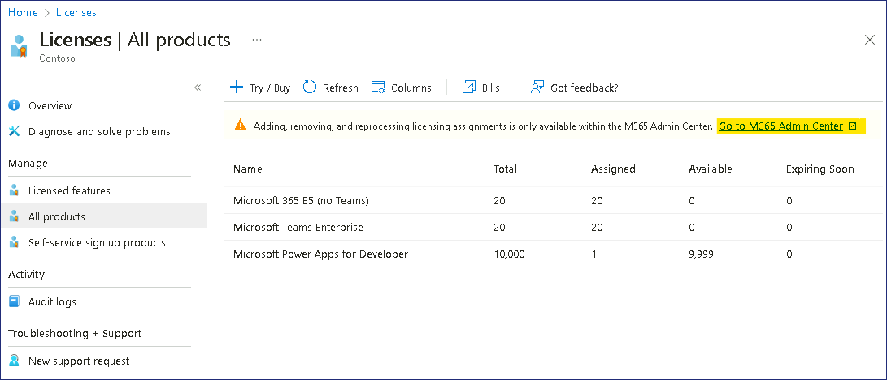

8.  Click on the **Microsoft 365 E5 (no Teams)** License
    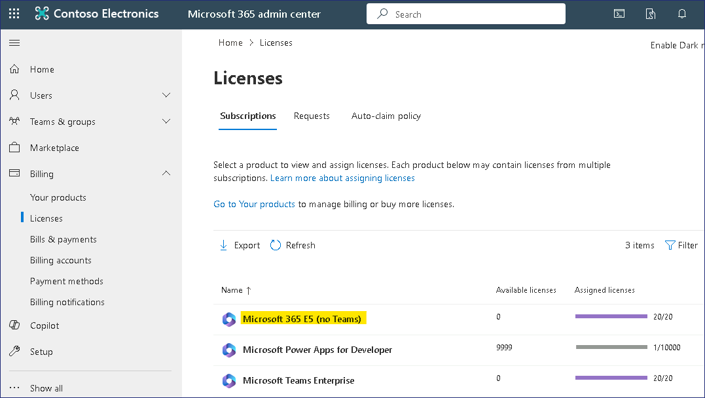

9.  From the list of users select the below users and then click on **Unassign licenses**

    * Lee Gu
    * Nestor Wilke
    * Patti Fernandez
    * Pradeep Gupta

    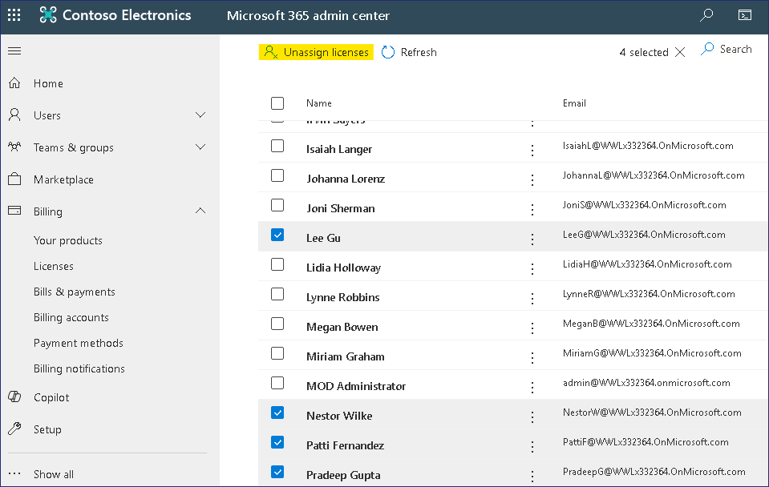

10. When prompted to Unassign 4 licenses click on the **Unassign** button.

    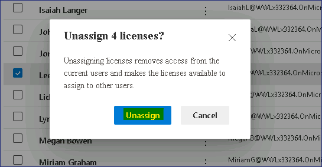

    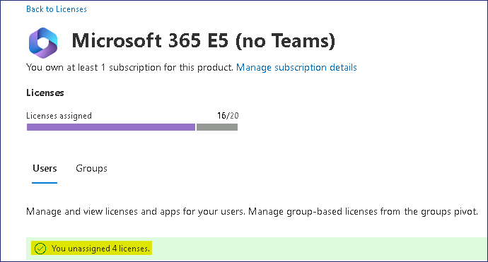

11. While still on the **Microsoft 365 E5 (no Teams)** license page, select the **Groups** tab and then click on **Assign license**

    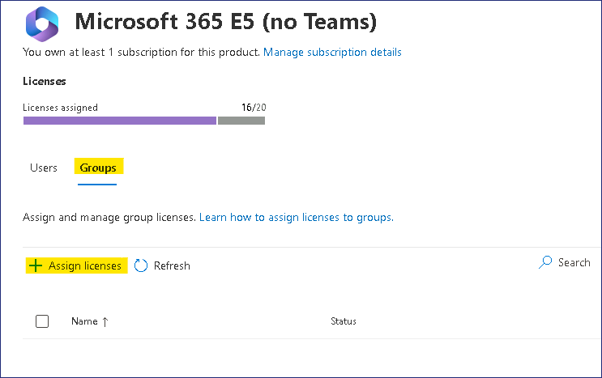

13. On the **Assign license to groups** window, select the **Research101** and **Sales101** groups and then click on **Assign** button.

    

3. You should get the notification as shown in below image.

    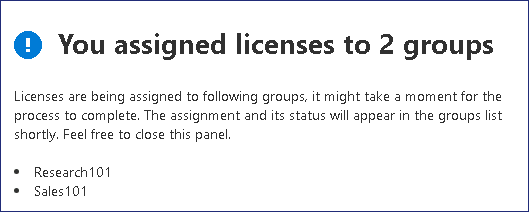

4. Both the Groups should have the license assigned.
    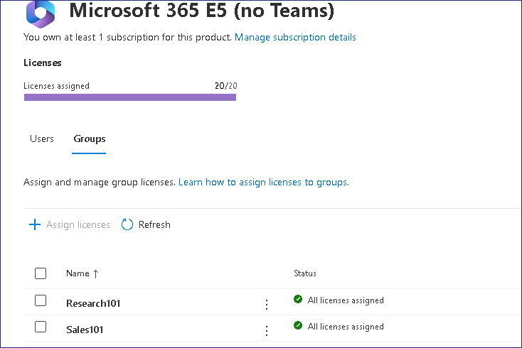

### Task 2 – Add a Guest account and create an External Collaborators group

1. Open the Edge browser and login to the **Microsoft Entra admin
    center** `https://entra.microsoft.com` page.

2. If prompted for credentials enter your **Office365 Tenant
    Credentials** provided on the **Home/Resources** tab** of the lab Interface as
    show in the Image.

3. Select **Entra ID** expand **Users**, select **All Users**, the from
    the **New user** drop-down menu select **Invite external user**.

    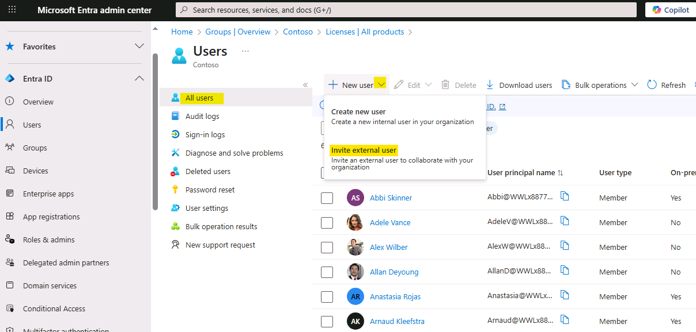

4. On the Invite external user page, provide the below details

    - Email – your personal outlook email address or create a new
      outlook email for testing.

    - Display name – `External User`

    - Message – `Invite to my Org`

5. Click on **Next: Properties**

    

6. On the **Properties** tab, set the Usage location to **United
    States** and then click on **Review + invite** button.

    

7. On the **Review + invite** tab, click on the **Invite** button.

    

    

8. Open an InPrivate window and open the Outlook for the external
    account on which the invite was sent.

    

9. Click on the **Accept invitation** link.

10. Click on the **Accept** button to grant permission.

    

11. You should successfully be logged into My Apps portal for the
    Microsoft Entra Tenant.

    

12. Switch back to the tab with **Microsoft Entra admin center** portal
    logged with Tenant admin.

13. Select **Entra ID** expand the **Groups**, select **All groups** then click on **New group**.

    

14. Create the group with below details.

    - Group type – **Security**

    - Group name – `External Collaborators`

    - Group Description – `Group of External Users`

    - Microsoft Entra roles can be assigned to the group – **Yes**

    

    - Scroll down and add the Invited user account – External User and then
      click on **Select** button.

    

15. Click on **Create** button

    

16. Click on the Yes button when prompted.

    

    

## Exercise 4 – Enabling Microsoft Entra ID per-user Multifactor Authentication

To secure user sign-in events in **Microsoft Entra ID**, you can require
multi-factor authentication (MFA). We can enable each account for
per-user Multi-Factor Authentication. When users are enabled
individually, they perform multi-factor authentication each time they
sign in (with some exceptions, such as when they sign in from trusted IP
addresses or when the remember MFA on trusted devices feature is turned
on).

1. Open the Edge browser and login to the **Microsoft Entra admin center** `https://entra.microsoft.com` page.

2. If prompted for credentials enter your **Office365 Tenant Credentials** provided on the **Home/Resources** tab of the lab Interface as show in the Image.

3. In the **Microsoft Entra admin center** navigate
    to **Entra ID** then expand Users, click **All** **Users** then
    click on the ellipses **…** then select **Per-user MFA**.

    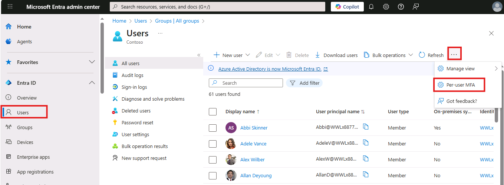

4. Select the users **Abbi Skinner** and **Beth Burke** and click
    on **Enable**.

    

5. On the Message About enabling multi-factor auth, click on **Enable**.

    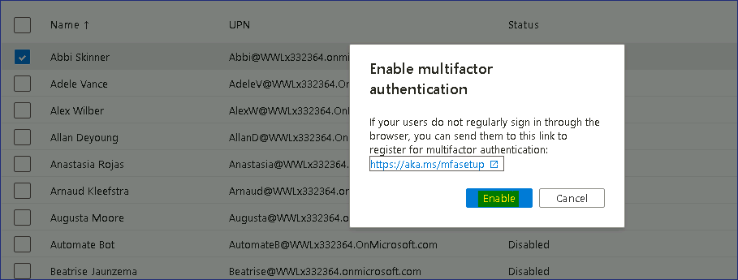

6. You should receive a notification as shown in below image.

    

7. Open a browser in InPrivate/incognito mode and login to **My Apps
    portal** `https://myapps.microsoft.com`.

8. Enter the credentials for **Beth Burke** account

    - Username – `Beth@` copy and paste the **Tenant name** from the **Home/Resources** tab.

    - Password – `Pa55w.rd`

9. You will be prompted to More information is required, click
    on **Next**

    .

10. On the **Start by getting the app** page, click on **Next**

    

11. Install the **Microsoft Authenticator App** on your phone from the
    play store or app store as appropriate.

12. On the **Set up your account page**, select **Next.**

    

13. On the **Scan the QR code** page, scan the QR image to add the
    account on your Microsoft Authenticator App on your phone.

    

14. Now, select **Next**.

    

15. When prompted, approve the notification on your phone. Once you see
    that the notification is approved, select **Next**.

    

16. Click on **Done**

    

17. You should be logged in to the **My Apps Portal**

    

18. You have completed this task, please proceed ahead with the next
    task.

## Exercise 5 – Enabling Conditional Access for the Research Group

Conditional Access policies at their simplest are if-then statements, if
a user wants to access a resource, then they must complete an action.

We will set a Conditional Access policy to require MFA for Research
Group only when the Access **Microsoft Forms**

1. Open the Edge browser and login to the **Microsoft Entra admin
center** `https://entra.microsoft.com` page.

2. In the **Microsoft Entra admin center**, scroll down and select **Conditional Access**. Click on **Create new policy**.

    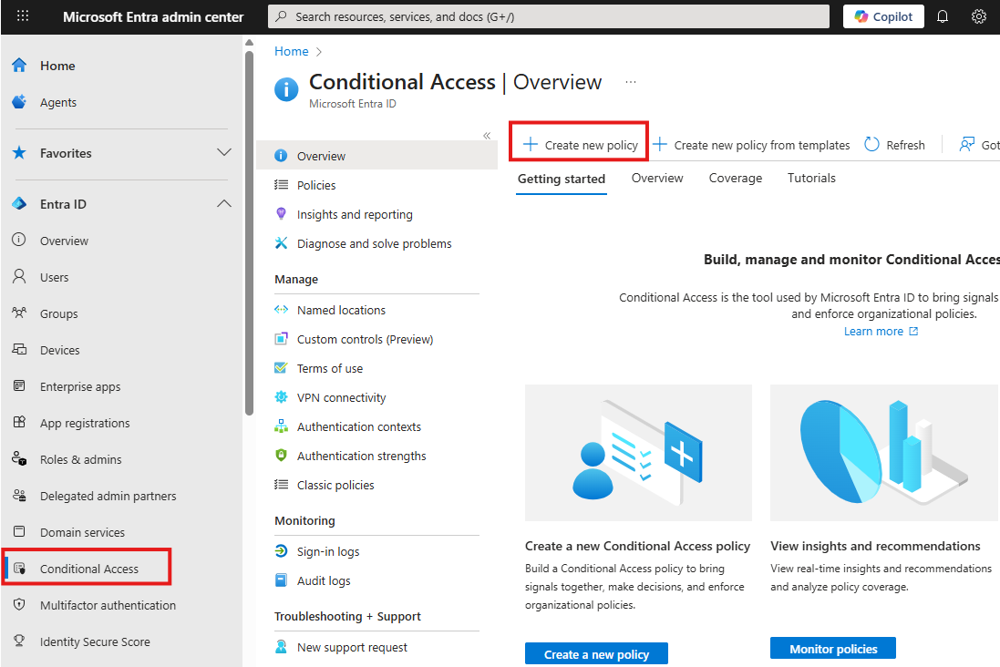

3. On the **New Conditional Access Policy** page, provide the below details

   - Name – `CA for Microsoft Forms`

   - Under **Users**, select **0 Users and Groups selected**. Then under
   **Include**, choose **Select users and groups**. Select the check
   box near **Users and groups**. Then under **Select**, choose **0
   users and groups selected**.

   
   

   - Scroll down on the **Select users and groups** page, select
   **Research101**. Choose **Select**.

   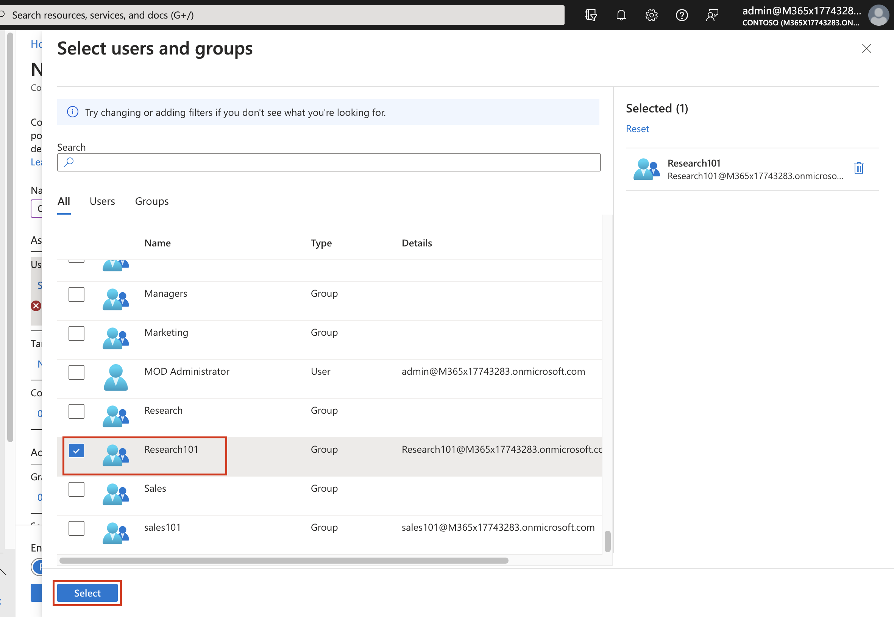

   - Under **Target Resources**, select **No target resources selected**.
   Then under **Include**, choose **Select apps**. Under select, choose
   **None**. In the side pane, search for and select `Microsoft Forms`
   by selecting the check box near the app. Then choose **Select**.

   

   - Similarly select **Access Controls** \ **Grant** \ **0 controls
   selected** \ **Grant access** \ **Require multi-factor
   authentication** \ **Select**.

   

   - Enable policy – **Report-only**

   - Click on **Create**

   

4. You should get the notification as shown in below image.

    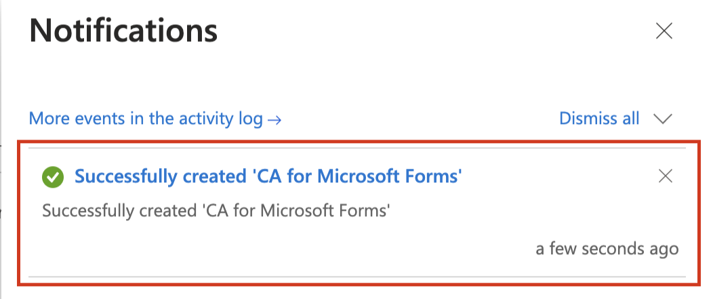

    > **NOTE** - Report-only mode is a new Conditional Access policy state that allows administrators to evaluate the impact of Conditional Access policies before enabling them in their environment. With the release of report-only mode:

   - Conditional Access policies can be enabled in report-only mode.

   - During sign-in, policies in report-only mode are evaluated but not
   enforced.

   - Results are logged in the Conditional Access and Report-only tabs of
   the Sign-in log details.

   - Customers with an Azure Monitor subscription can monitor the impact of
   their Conditional Access policies using the Conditional Access
   insights workbook.​

5. Now open a browser in InPrivate/incognito mode and login to
**MyApps portal** – `https://myapps.microsoft.com`.

1. Login using **Logan Boyle’s** credentials you will be signed in
without any additional information required prompt

     - Username – `Logan@` paste the **Tenant name** from the **Home/Resources** tab.

     - Password – `Pa55w.rd`

         

    > **Note** - if the password does not work, then switch back to the tab with the Office 365 Tenant Admin login and navigate to `https://entra.microsoft.com/#view/Microsoft_AAD_UsersAndTenants/UserManagementMenuBlade/~/AllUsers/menuId` choose the User **Logan Boyle** and then **reset the password**. The new password need to be changed, you can use `Pa55w.rd98` as the new password.

    

1. Click on Forms to access **Microsoft Forms**.

    

2. Select **Create new**.

    

3. Switch back to the **Microsoft Entra admin center** and set the
Conditional access policy to **On** and **Save** it.

    

1. Now log off on the InPrivate tab and login to **MyApps portal**
– `https://myapps.microsoft.com`.

1. Login using **Logan Boyle’s** credentials you will be signed in
without any additional information required prompt

     - Username – `Logan@` paste the **Tenant name** from the **Home/Resources** tab.

     - Password – `Pa55w.rd`

1. Click on Forms to access **Microsoft Forms**.

    

2. You will notice that the Conditional Access policy requires you to
perform MFA in order to access Forms.

    

1. Click on **Next** and complete the MFA process to gain access to
Forms.

1. You would be required to go through the Microsoft Authenticator
process, once completed you will be logged in Microsoft Forms
successfully as shown in below images

    

1. You should be able to login successfully

    

    

## Summary

In this lab we assigned the required licenses and created the required
records using the provided public domain. We enabled MFA for our users
and assigned a basic conditional access policy to a group of users in
our organization.
