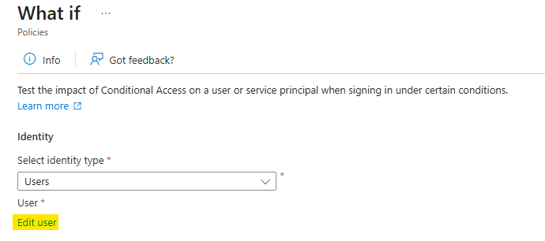
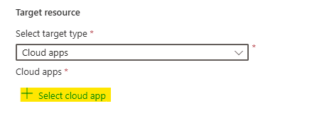
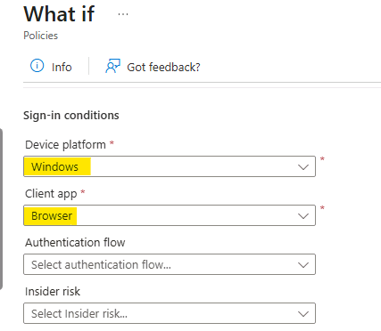
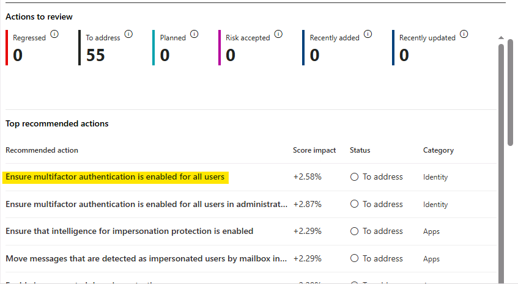
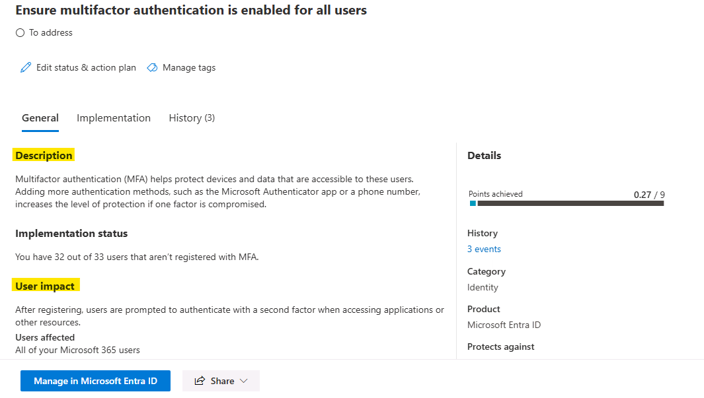
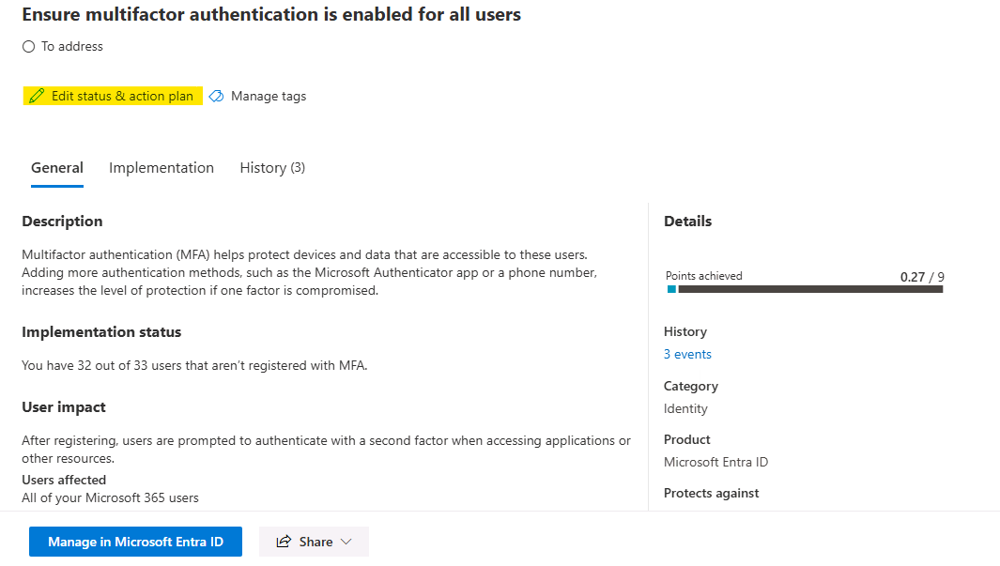
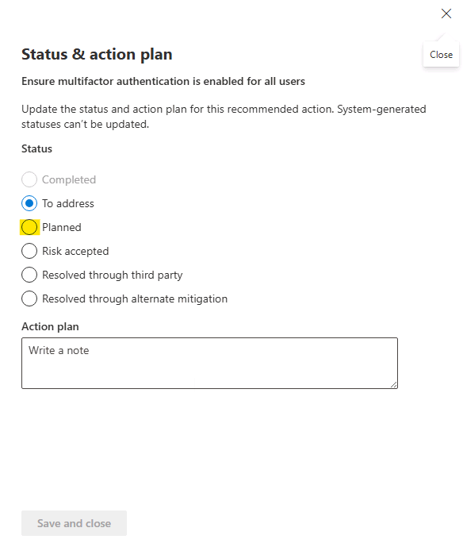
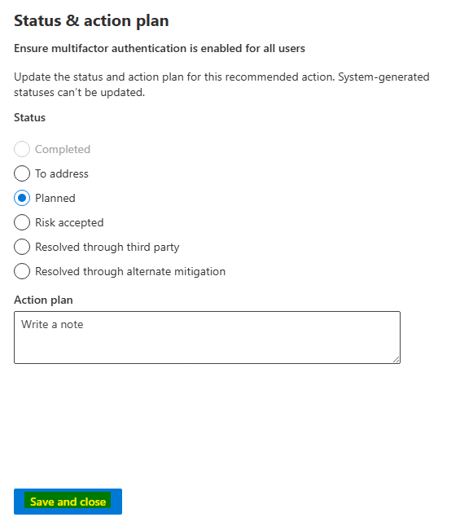
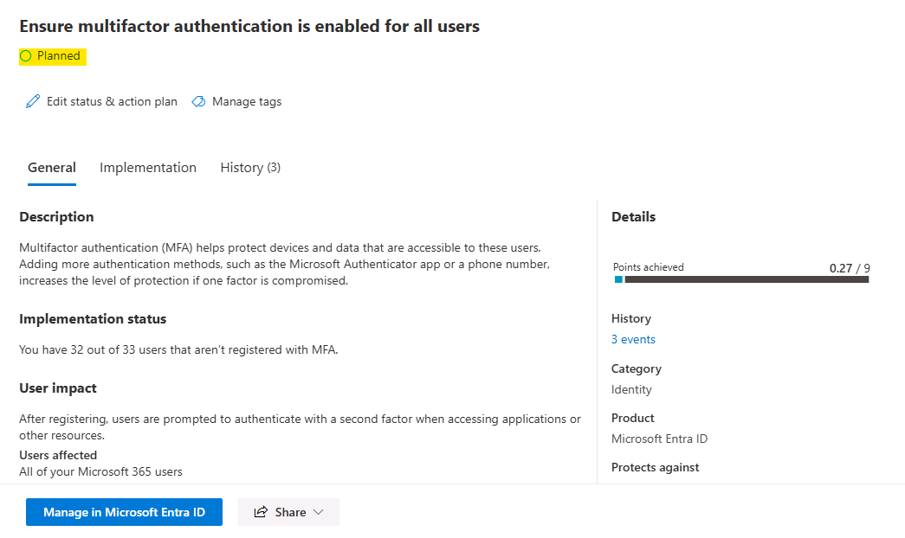

# Lab 2 – Implementing Microsoft Entra Identity Protection​

## Objective:

In this lab we will explore how to configure and enable user risk
policy. We will also explore how to block a user or a group of users
from using any cloud app using a conditional policy.

We will also see how to monitor and manage security posture using
Identity Secure Score.

## Exercise 1 – Enable User risk policy.

### Task 1 – Configure a user risk policy

1. Sign in to the `https://entra.microsoft.com` using your
    **Office 365 tenant credentials**.

1. On the lefthand menu, expand **ID Protection**, and
    then select **Dashboard**.

    

2. In the **Identity protection** page, in the left navigation,
    select **User risk policy**.

    

3. Under **Assignments**, select **All users** and review the available
    options. Then choose **Select individuals and groups**. 

    

4. In the **Select Users** pane, select the group **Sales101**. Then
    choose **Select**.

    

5. Under **User risk**, select **Low and above**. In the User risk
    pane, select **High** and then select **Done**.

    

6. Under **Controls** \ **Access**, select **Allow access** and
    **Require password change**, then select **Done**.

    

7. Under **Policy enforcement**, select **Enabled** and then
    select **Save**.

    

    

### Task 2 – Enable Sign-in risk policy

1. On the **Identity Protection** page, in the left navigation,
    select **Sign-in risk policy**.

    

8. Under **Assignments**, select **All users** and review the available
    options. Then choose **Select individuals and groups**. We will
    limit our policy rollout to **Sales** team.

    

9. In the **Select Users** pane, select the group **Sales101**. Then
    choose **Select**.

    

10. Under **User risk**, select **Low and above**. In the User risk
    pane, select **High** and then select **Done**.

    

11. Under **Controls** \ **Access**, select **Block access**. Select
    the **Require multi-factor authentication** check box and then
    select **Done**.

    

12. Under **Policy enforcement**, select **Enabled** and then
    select **Save**.

    

    

Your organization needs to be able to limit user access to its internal
applications. You must deploy a Conditional access policy.

## Exercise 2 – Set a conditional access policy to block a user from accessing Viva Engage

### Task 1 – Confirm Allan Deyoung has access to Engage

1. Launch a new InPrivate browser window in your lab VM.

2. Navigate to `https://www.office.com`.

14. When prompted, log in as **Allan Deyoung**:

    * Username – `alland@` Paste the Tenant name from the **Home/Resources
    tab**

    * Password – Paste the User Password from the Resources tab.

    

    > **Note** - if the password does not work, then switch back to the tab with the Office 365 Tenant Admin login and navigate to `https://entra.microsoft.com/#view/Microsoft_AAD_UsersAndTenants/UserManagementMenuBlade/~/AllUsers/menuId` choose the User **Allan Deyoung** and then **reset the password**. The new password need to be changed, you can use `Pa55w.rd98` as the new password. 

    

15. Click on **Expand Navigation**

    

15. Click on **App** 

    

15. Scroll down and then click on the **Engage** icon to
    see that it loads correctly.

    

17. The portal should load successfully.

    

### Task 2 – Create a conditional access policy

Microsoft Entra conditional access is an advanced feature of Microsoft
Entra ID that allows you to specify detailed policies that control who
can access your resources. Using Conditional Access, you can protect
your applications by limiting users’ access based on things like groups,
device type, location, and role.

1. Browse to `https://entra.microsoft.com` and sign in using
    the **Office 365 tenant credentials**.

2. On the lefthand menu, under Entra ID, scroll down and 
    select **Conditional access**. On the **Overview** page,
    click **+ Create new policy**.

    

3. On the **New Conditional Access Policy** page, provide the below
    details

    - Name – `Block Engage for Allan Deyoung`

    - Under **Users**, select **0 users and groups selected/Specific
    users included**. Then under **Include**, choose **Select users
    and groups**. Select the check box near **Users and groups**. Then
    under **Select**, choose **0 users and groups selected**.

    

    - Scroll down on the **Select users and groups** page, select **Allan
  Deyoung**. Choose **Select**.

    

  - Under **Target Resources**, select **No target resources selected**.
  Then under **Include**, choose **Select apps**. Under select, choose
  **None**. In the side pane, search for and select `Viva Engage` by
  selecting the check box near the app. Then choose **Select**.

    

  - Under **Access controls**, within the **Grant** section, select **0
  controls selected**. In the Grant pane, select **Block access** |
  **Required all the selected controls** and then choose **Select**.

    

  - Enable policy – **On**. Click on **Create**.

    

    

> **Note** - This policy is being configured for the exercise only and is
being used to quickly demonstrate a conditional access policy.

Keep the page open we will return to this page in **Task 4**.

### Task 3 – Test the conditional access policy

You should test your conditional access policies to ensure they working
as expected.

1.  Close the InPrivate Window or Log out completely.

2.  Launch a new InPrivate browser window in your lab VM.

3.  Navigate to `https://www.office.com`.

4.  When prompted, log in as **Allan Deyoung**:

    * Username – `alland@` copy and paste the Tenant name from the **Resources tab**

    * Password – Paste the User Password from the Resources tab.

    

    > **Note** - if the password reset in the previous task, use the new password.

    

5. Click on **Expand Navigation**

    

5. Click on **App** 

    

5. Scroll down and then click on the **Engage** icon to
    see that it loads correctly.

    

6.  Verify you are prevented from accessing **Viva Engage**.

    

    > **Note** - If you were already signed in the policy may not get applied, hence close the tab, wait 1 minute, and then
    re-login. Once you log
    out and sign-in, your Engage session should deny access. To disable the
    policy, follow the given steps.

7.  Close the tab and return to the Conditional Access page.

8.  Select the **Block Engage for Allan Deyoung** policy.

9.  Under **Enable policy**, select **Off** and then select **Save**.

### Task 4 – Use ‘What if’ to test conditional access policies

1. Browse to `https://entra.microsoft.com` and sign in using
    the **Office 365 tenant credentials**.

2. On the lefthand menu, under **Entra ID**, scroll down and  then select **Conditional access.** In the navigation pane,
    select **Policies**. Select **What If**.

    

3. Under **Identity**, click on **Edit user**

    

29. Choose **Allan Deyoung** as the user. Then choose **Select**.

    

30. Under **Target resources**,
    select **+ Select cloud app**
    
    

31. In the select pane, choose **Viva Engage**. And then choose
    **Select**.

    

32. Under **Sign-in conditions**, for Device platform select **Windows** and for Client app select **Browser**.

    

32. Select **What if**.

    

33. You will be provided with a report at the bottom of the tile
    for **Policies that will apply** and **Policies that will not
    apply**.

    

This allows you to test the policies and their effectiveness before
enabling the policies.

### Task 5 – Configure sign in frequency controls using a conditional access policy

As part of your company’s larger security configuration, you must test a
conditional access policy that can be used to control sign in frequency.

1. Browse to `https://entra.microsoft.com` and sign in using
    the **Office 365 tenant credentials**.

34. On the lefthand menu, under **Entra ID** and then
    select **Conditional access**. On the **Overview**,
    click **+ Create new policy**.

    

35. On the **New Conditional Access Policy** page, provide the below
    details.

    - Name – `Sign in frequency`

    - Under **Users**, select **0 users and groups selected/Specific
      users included**. Then under **Include**, choose **Select users
      and groups**. Select the check box near **Users and groups**. Then
      under **Select**, choose **0 users and groups selected**.

    

- Scroll down on the **Select users and groups** page, select **Joni
  Sherman**. Choose **Select**.

    

- Under **Target Resources**, select **No target resources selected**.
  Then under **Include**, choose **Select apps**. Under select, choose
  **None**. In the side pane, search for and select **Office 365** by
  selecting the check box near the app. Then choose **Select**.

    

- Under **Access controls**, within the **Sessions** section, select **0
  controls selected**. In the **Grant** pane, select **Sign-in
  frequency,** in the value box, enter **14**. Select the units menu,
  select **Days**, and then choose **Select.**

    

- Enable policy – **On**. Click on **Create**.

    

    

## Exercise 3 – Monitor and managed security posture with Identity Secure Score

1. Browse to `https://entra.microsoft.com` and sign in using the **Office 365 tenant credentials**.

2. On the left hand menu, under **Entra ID,** scroll down and select **Identity Secure Score.** 

3. If required select **Identity Secure Score** from the sub-menu. This will take you to the Identity Secure Score
    dashboard.

    

4. Click on the link **View your Microsoft Secure Score** this will open a new tab and redirect to Microsoft Defender portal.

    
    

5. Scroll down and select the first **Recommended action**. 

    

6. Review the **Description** and **User impact** sections.

    

7. Click on **Edit status & action plan** button

    

8. From the Status & action plan tab, select the radio button for **Planned**

    

9. Click on the **Save and close** button.

    

10. Notice the Status has been updated from **To Address** to **Planned**.

    

In contrast to the **Recommended actions** in Microsoft Defender for Cloud
and Microsoft 365 Defender, these improvement actions are specific to identity. This provides a more focused list of potential actions to your security posture management. Any improvement actions initiated from this
list will also provide an impact to your overall tenant security
posture.

## Summary:

In this lab we enabled user risk policy, created a conditional access policy to block a user from accessing a cloud app, and explored the Identity Secure Score.