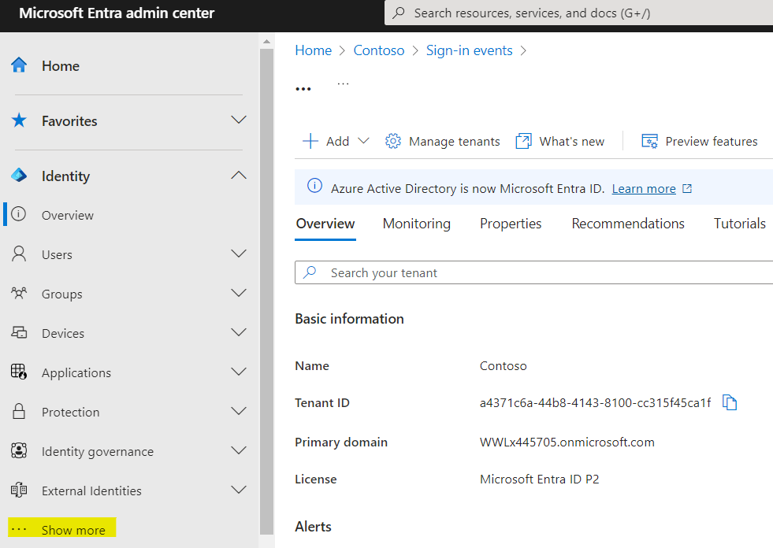
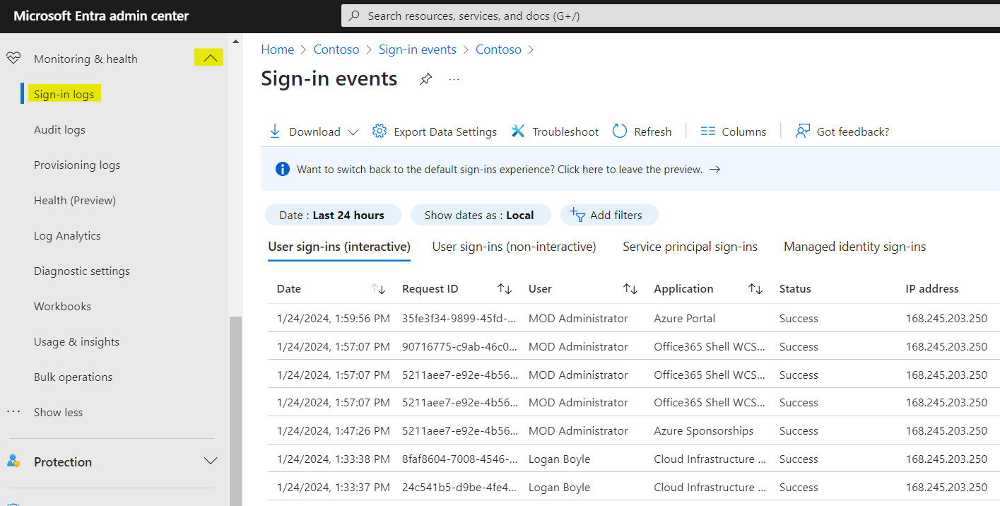
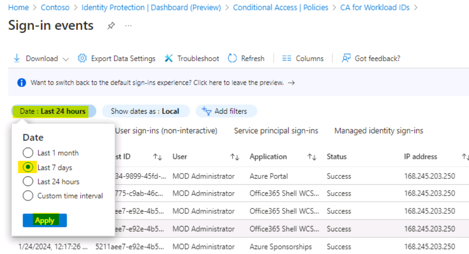
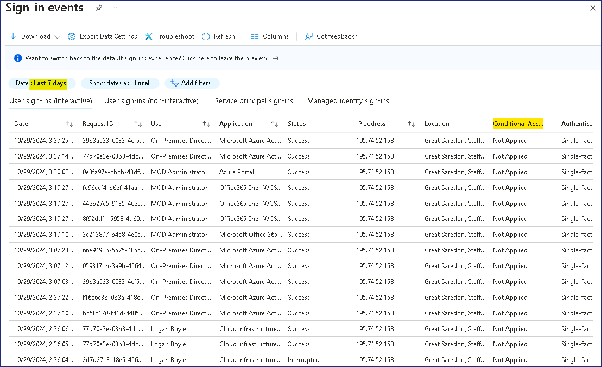
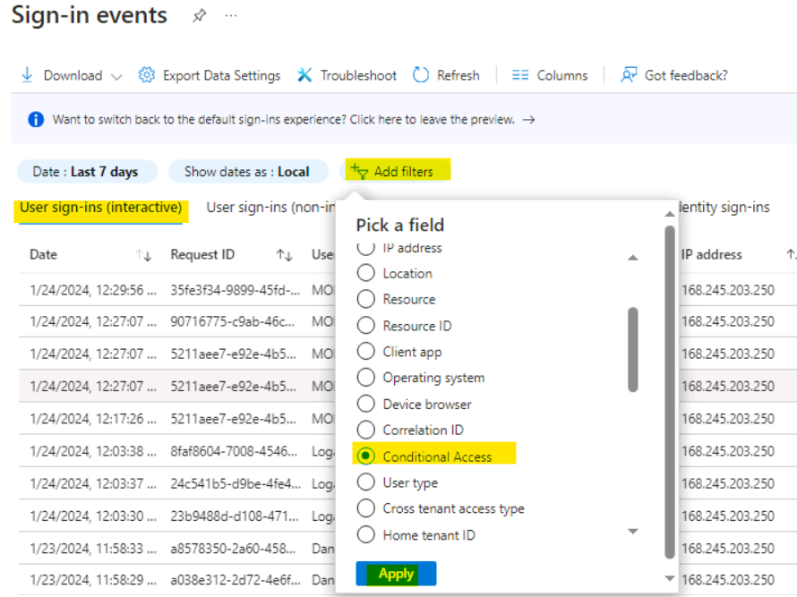
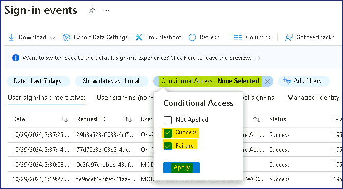
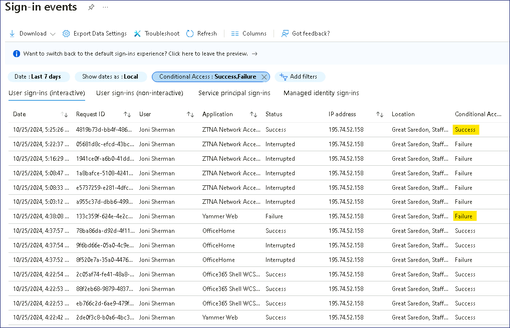

# Lab 6 – Workload Identities

## Objective:

Conditional Access policies historically applied only to users when they
access apps and services like SharePoint Online. Now the support is
extended for Conditional Access policies to be applied to service
principals owned by the organization. This capability is called
Conditional Access for workload identities. In this lab we will explore
how to opt for Workload Identities trial and create a CA Policy for any
service principle.

## Exercise 1 – Sign up for Workload Identities trial.

1.  Open the Edge browser and go to
    **+++https://admin.microsoft.com/#/catalog**.

2.  Search for **+++Workload+++** and select **Details** under
    **Microsoft Entra Workload ID**.

3.  On the details page select **Start free trial**.

4.  Select Try now.

5.  Then select **Continue**.

6.  From the left navigation, select **Active us**ers under **Users**.
    Select the admin user **MOD Administrator** from the list, expand
    the three dots **(…)** in the top bar and select **Manage product
    Licenses**.

7.  Select **Microsoft Entra Workload ID** and then select **Save
    changes**.

## Exercise 2 – Creating a Conditional Access policy for Workload Identities

1.  Browse to **+++https://entra.microsoft.com/+++** and sign in using
    the **Office 365 tenant credentials**.

2.  On the lefthand menu, under **Identity**, expand **Protection**, and
    then select **Conditional access**. On the **Overview (Preview)**,
    click **+ Create new policy**.

1.  On the **New Conditional Access Policy** page, provide the below
    details

    - Name – **+++CA for Workload IDs+++**

    - Under **Users**, select **0 users or workload identities
      selected**. Under **What does this policy apply to?**, select
      **Workload identities**.

- Under **Include**, choose **Select service principals**, and select
  **Box**. Then choose **Select**.

- Under **Target resources** \> **Cloud apps** \> **Include**, select
  **All cloud apps**. The policy applies only when a service principal
  requests a token.

- Under **Conditions** \> **Service principal risk**, set the
  **Configure** toggle to **Yes**. Select **High** as the levels of
  risk. Select **Done**.

- Under **Grant**, **Block access** is the only available option. Access
  is blocked when the specified risk levels are seen. Select the option
  and then choose **Select**.

- Enable policy – **On**. Click on **Create**.

## Exercise 3 – View the Sign-in logs for Conditional Access policy for Workload Identities

1.  Browse to **+++https://entra.microsoft.com/+++** and sign in using
    the **Office 365 tenant credentials**.

&nbsp;

2.  On the lefthand menu, under **Identity**, click on **…Show more.**

    

3.  Scroll down and expand **Monitoring & Health**, and then
    select **Sign-in logs.**

    

4.  Click on the **Date** filter and select **Last 7 days** and then
    click on **Apply**.

    

5.  Click on the **Service principal sign-ins** tab and review the
    **Conditional Access** column, here the event will appear if the
    Conditional Access Policy was triggered.

    

6.  Click on the **User sign-ins (interactive)** tab, then click on
    **Add** **filters** and choose **Conditional Access** then click on
    **Apply**.

    

7.  Click on the **Conditional Access** filter and then choose
    **Success** and **Failure**, the click on **Apply**.

    

8.  You should be able to **Sign-ins** with **Success** and **Failure**
    logs.

    

    **You have completed Lab 6 !!!!!!!**
